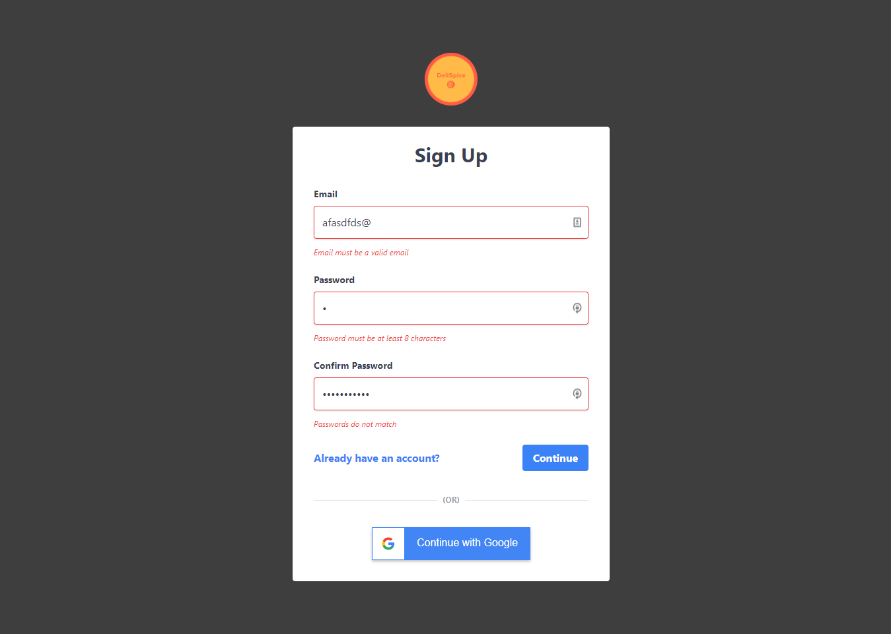
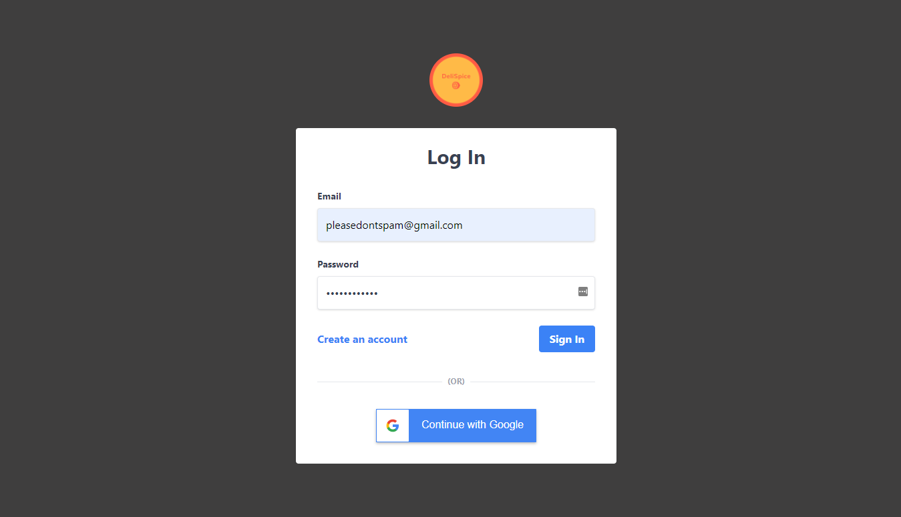
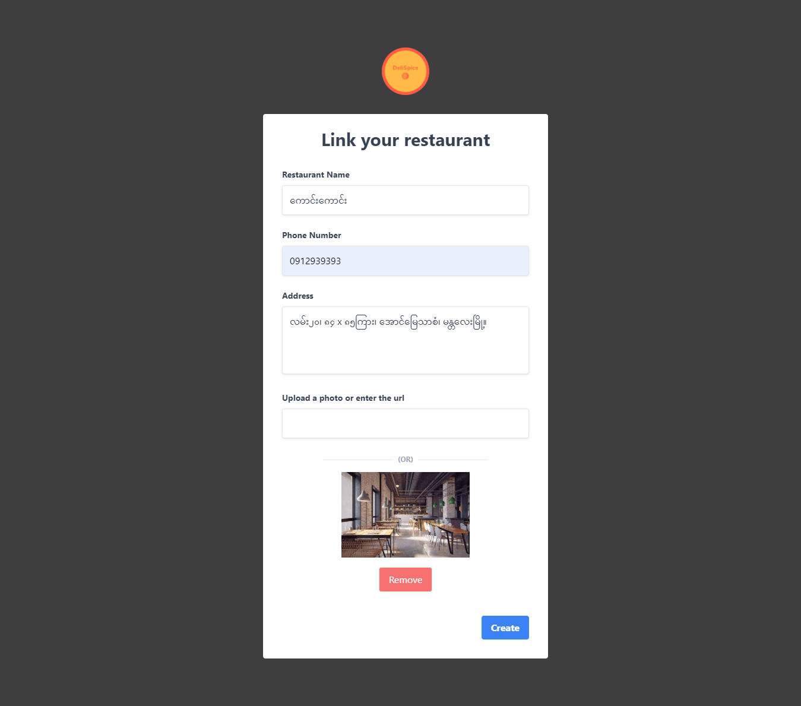
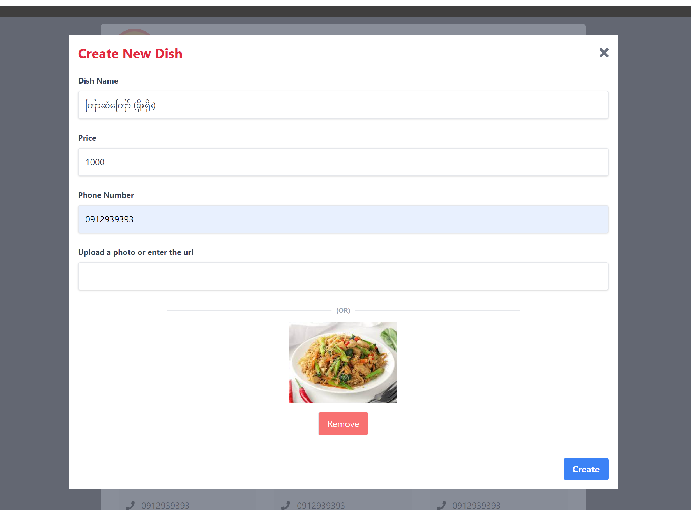
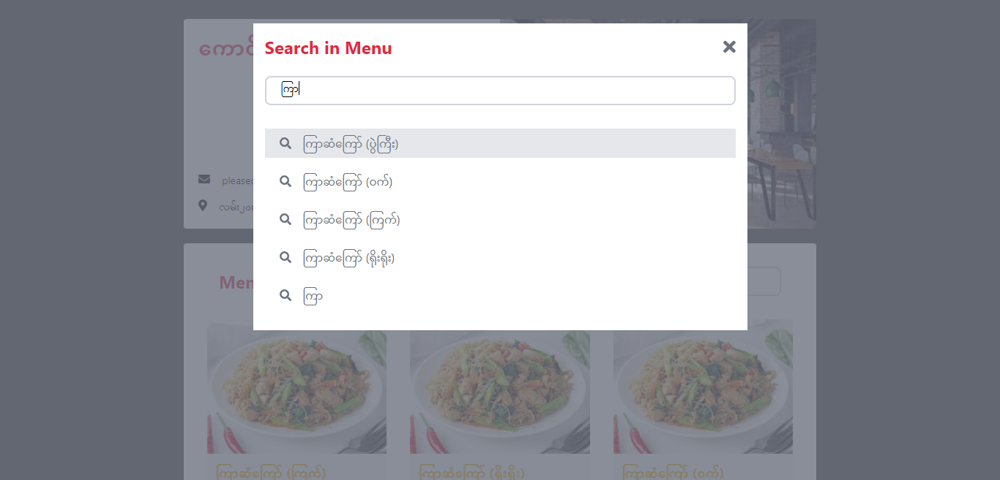
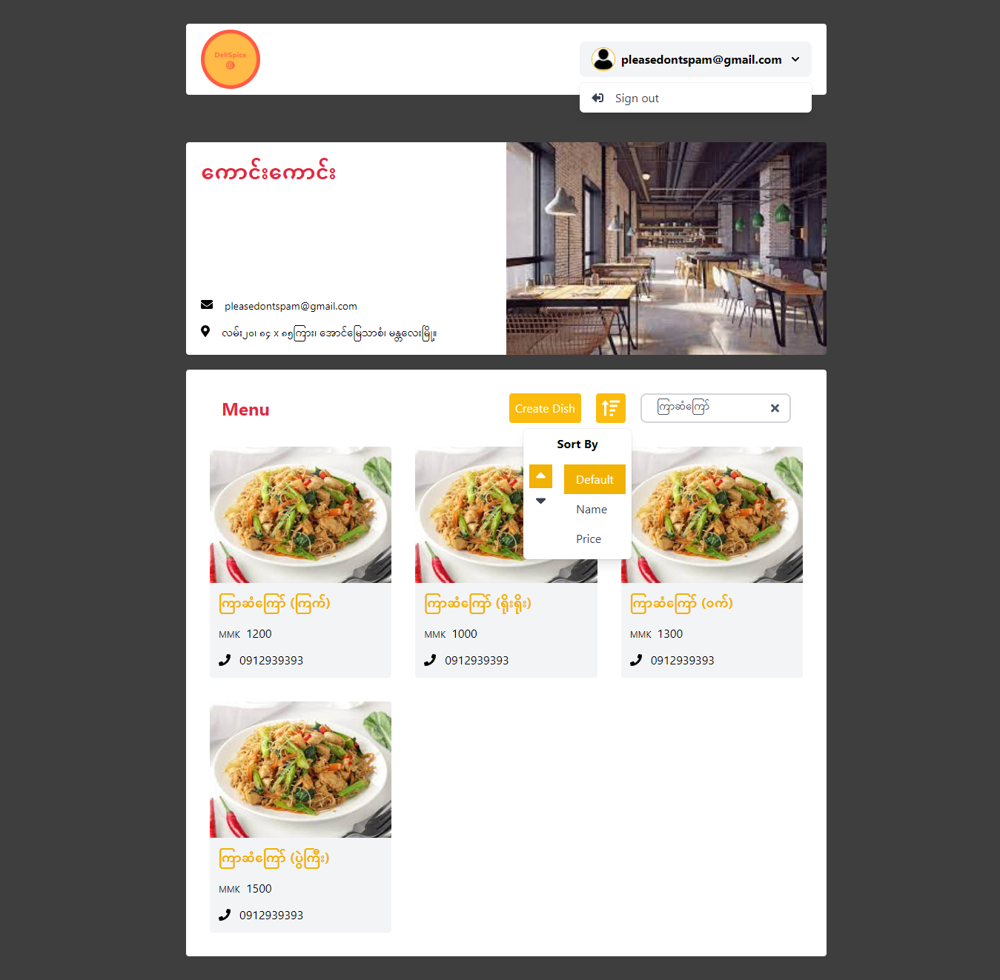
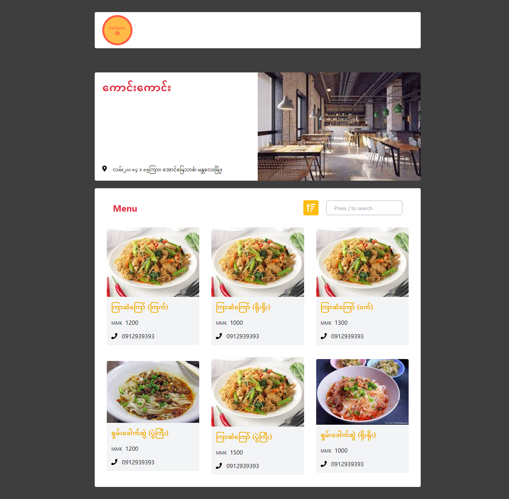

# DeliSpice - (Restaurant Management app)

[View source](https://github.com/HanMoeHtet/delispice) &nbsp;&nbsp; [Visit site](https://restaurant-dev-eda52.web.app/)

DeliSpice is a web app that you can use to mange your restaurant and serve your delicious food. You can add menu for your restaurant. Search in the menu and sort them based on name and price, etc. Customers can also view your menu except they don't have permissions to mangage it.

## Home page of the app

## Sign up page

## Log in page

## Create restaurant page

## Create Dish

## Search in menu

## Restaurant Page with search result 
--- 

## Public view (from customer's perspective)

## Get Started 
### Clone the repo

    git clone https://github.com/HanMoeHtet/delispice && cd delispice

### Create .env file and fill in the environment variables
    cp .env.example .env

### You can seed data if you want
    npm run seed

### Run the app
    npm run start

## Credits

- Icons from [https://fontawesome.com](https://fontawesome.com)
- Dummy images from the Internet
- Fake menu data from [https://www.themealdb.com](www.themealdb.com)

